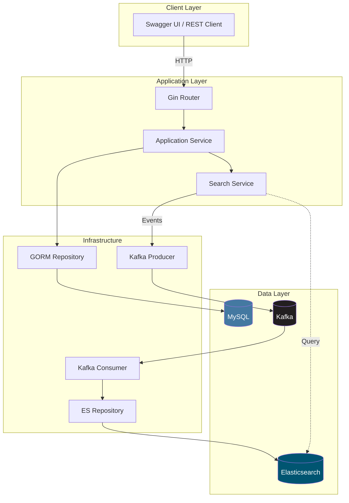
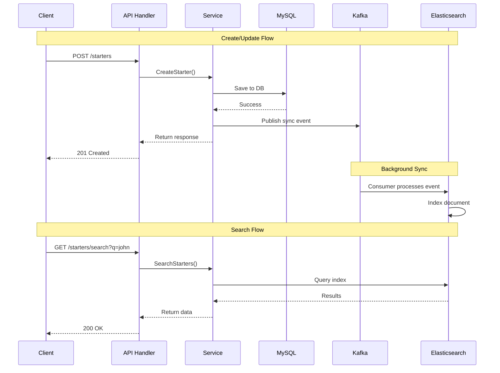
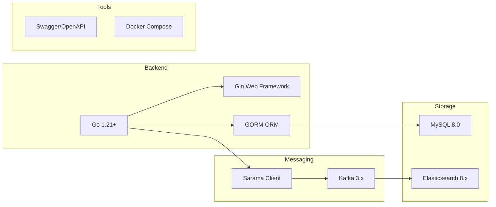
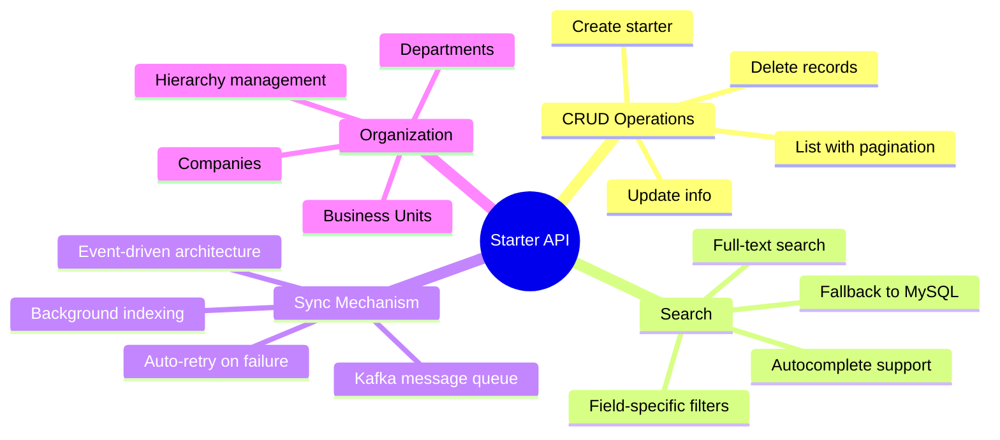
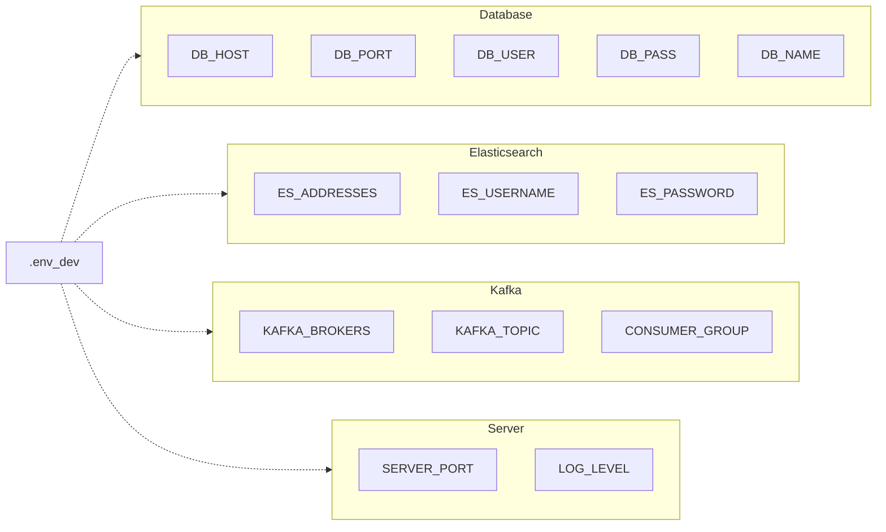
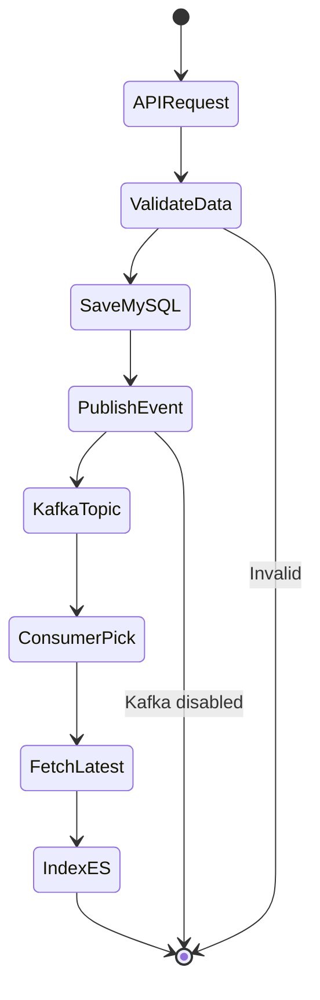
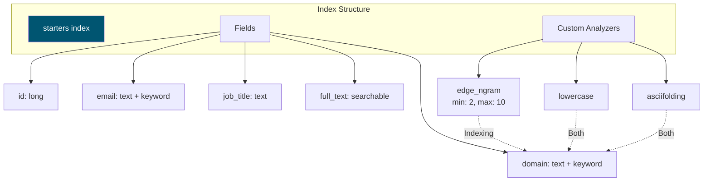
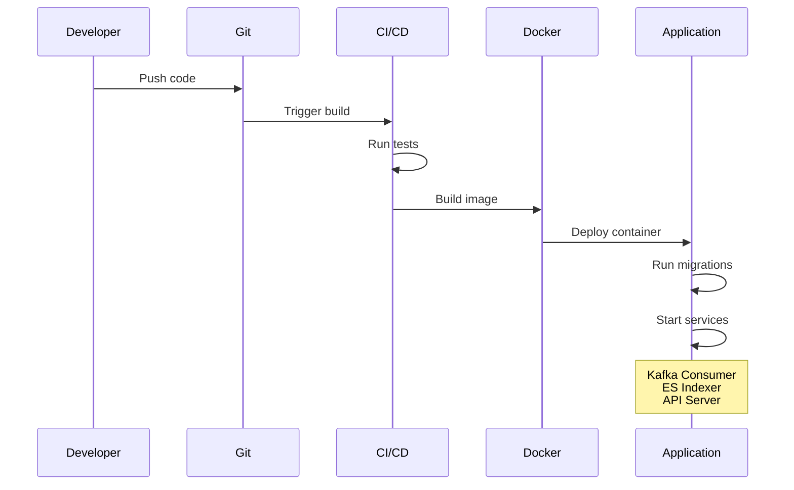
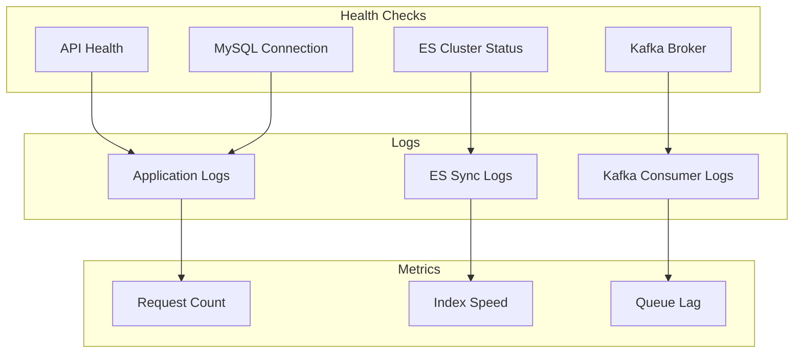
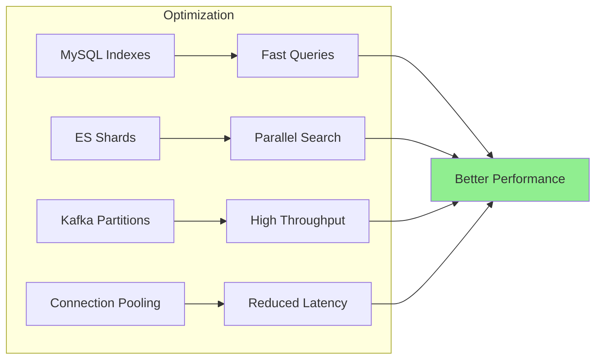

# Starter Management API

A Go-based REST API for managing employee onboarding with real-time search via Elasticsearch and event-driven sync using Kafka.

## Architecture Overview



## Data Flow



## Tech Stack



## Quick Start

### Prerequisites
- Docker & Docker Compose
- Ports available: `3000`, `3306`, `9092`, `9200`

### Run with Docker

```bash
# Start all services
make up

# Check status
make ps

# View logs
make logs-app

# Stop services
make down

# Clean everything (including volumes)
make clean
```

### Access Points

| Service | URL | Description |
|---------|-----|-------------|
| API | `http://localhost:3000/api/v1` | REST endpoints |
| Swagger | `http://localhost:3000/swagger/index.html` | API docs |
| Elasticsearch | `http://localhost:9200` | Search engine |
| Kibana | `http://localhost:5601` | ES visualization |

## Project Structure

```
.
├── cmd/api/                 # Application entry point (main.go)
├── internal/
│   ├── config/              # Environment configuration
│   ├── initialize/          # Bootstrap logic
│   ├── organization/        # Domain module
│   │   ├── domain/          # Entities & business rules
│   │   ├── application/     # Use cases & services
│   │   └── infrastructure/  # Repositories & adapters
│   └── shared/              # Shared infrastructure
│       ├── messagebroker/   # Kafka client
│       └── search/          # Elasticsearch
├── pkg/                     # Utilities (httpctx, response)
├── docs/                    # Swagger/OpenAPI specs
├── migrations/              # SQL migration scripts
├── docker-compose.yml       # Service definitions
└── Makefile                 # Build & deployment commands
```

## Key Features



## Configuration

### Environment Variables



**Note**: If Kafka or Elasticsearch is unavailable, the system gracefully degrades functionality.

## Event Flow



## Elasticsearch Index



## API Endpoints Summary

| Method | Endpoint | Description |
|--------|----------|-------------|
| `POST` | `/api/v1/starters` | Create new starter |
| `GET` | `/api/v1/starters/:id` | Get starter details |
| `PUT` | `/api/v1/starters/:id` | Update starter |
| `DELETE` | `/api/v1/starters/:id` | Delete starter |
| `GET` | `/api/v1/starters` | List all starters |
| `GET` | `/api/v1/starters/search` | Search starters |
| `POST` | `/api/v1/starters/reindex` | Trigger full reindex |

## Development Workflow



## Monitoring & Operations



## Troubleshooting

| Issue | Check | Solution |
|-------|-------|----------|
| API not responding | `make logs-app` | Check port 3000 availability |
| Search not working | `curl localhost:9200` | Verify ES is running |
| Sync delays | `make logs-kafka` | Check Kafka consumer lag |
| Missing data | MySQL connection | Verify DB credentials in `.env_dev` |

## Performance Considerations



## License

MIT

## Support

For issues or questions, please check the logs:
```bash
make logs-app     # Application logs
make logs-mysql   # Database logs
make logs-es      # Elasticsearch logs
make logs-kafka   # Kafka logs
```