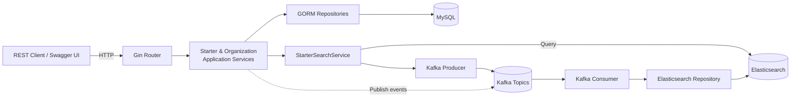
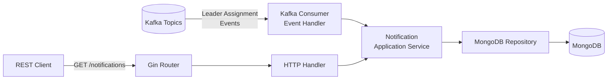
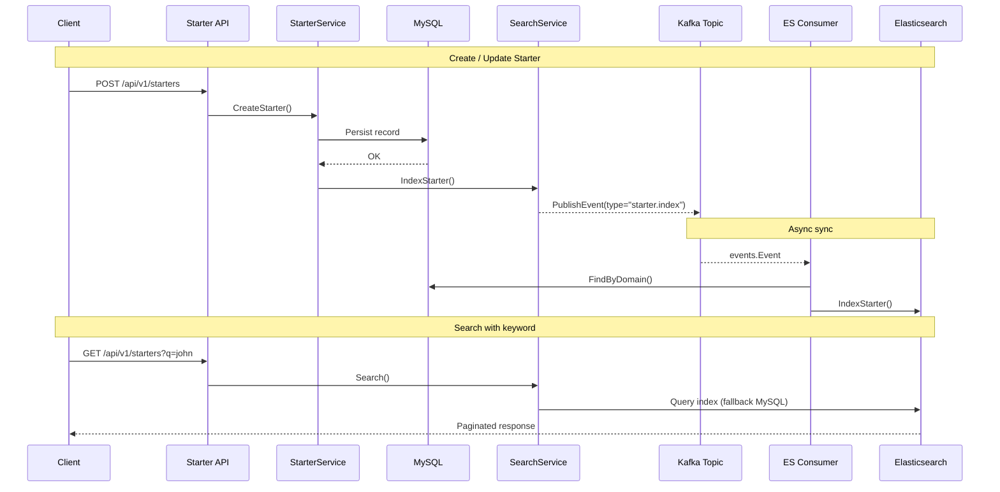
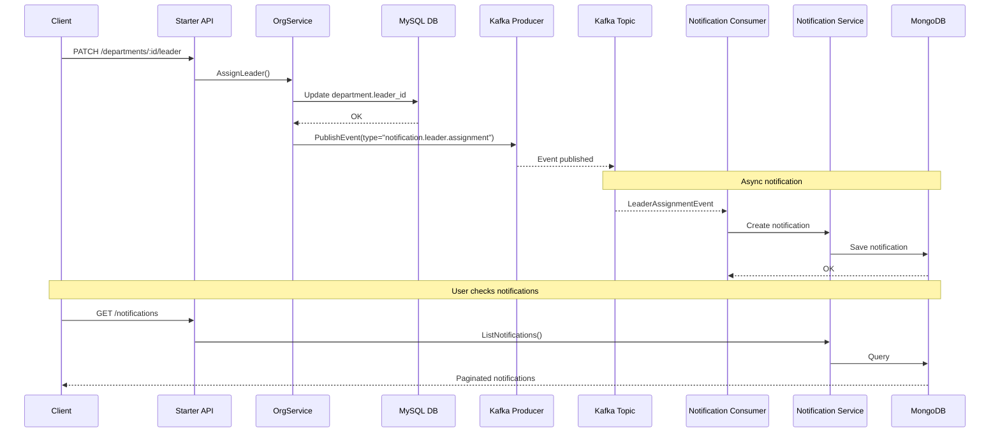

# Go Microservices - Starter & Notification Management

A microservices-based system built with Go, featuring:

- **Starter Service**: CRUD operations for starters, departments, and business units with Elasticsearch search
- **Notification Service**: Event-driven notification system consuming Kafka events

Core technologies: Go, Gin, GORM, MongoDB, MySQL, Kafka, Elasticsearch

## Getting Started

### Prerequisites

- Docker & Docker Compose
- Go 1.21+ (for local development)
- Make (optional, for using Makefile commands)

### Quick Setup

**Important**: This project uses two Docker Compose files:

- `docker-compose.infra.yml` - Infrastructure services (MySQL, MongoDB, Kafka, Elasticsearch)
- `docker-compose.yml` - Application services (Starter & Notification services)

You must start infrastructure services first, then application services.

1. **Clone the repository**

   ```bash
   git clone https://github.com/kiin21/go-rest.git
   cd go-rest
   ```

2. **Configure environment variables**

   Both services include example configuration files:

   ```bash
   # Starter Service
   cp services/starter-service/.env_dev.example services/starter-service/.env_dev

   # Notification Service
   cp services/notification-service/.env_dev.example services/notification-service/.env_dev
   ```

3. **Start infrastructure services first**

   ```bash
   make infra-up
   # This starts: MySQL, MongoDB, Kafka, Zookeeper, Elasticsearch
   # Or: docker compose -f docker-compose.infra.yml up -d
   ```

   Wait for all services to be healthy. You can check with:

   ```bash
   docker compose -f docker-compose.infra.yml ps
   # All services should show status as "Up" or "healthy"
   ```

4. **Start application services**

   ```bash
   make up
   # This starts: Starter Service, Notification Service
   # Or: docker compose up -d
   ```

5. **Verify services are running**

   ```bash
   make ps
   # Check health endpoints:
   # Starter Service: http://localhost:8080/health
   # Notification Service: http://localhost:8081/health
   ```

6. **Access the application**
   - **Starter Service API**: `http://localhost:8080/api/v1`
   - **Swagger Documentation**: `http://localhost:8080/swagger/index.html`
   - **Notification Service API**: `http://localhost:8081/api/v1`
   - **Elasticsearch**: `http://localhost:9200`
   - **Kibana** (optional): `http://localhost:5601`

### Environment Configuration

**Starter Service** (`services/starter-service/.env_dev`):

- `DB_URI` - MySQL connection string
- `SERVER_PORT` - HTTP server port (default: 3000)
- `ELASTICSEARCH_ADDRESSES` - Elasticsearch URL
- `KAFKA_BROKERS` - Kafka broker addresses

**Notification Service** (`services/notification-service/.env_dev`):

- `MONGODB_URI` - MongoDB connection string
- `SERVER_PORT` - HTTP server port (default: 8081)
- `KAFKA_BROKERS` - Kafka broker addresses

## Services Overview

### Starter Service

Backend Go service for managing starters, departments, and business units. Core data lives in MySQL, while Kafka and
Elasticsearch keep the search index in sync.

**Architecture:**



### Notification Service

Event-driven notification service that consumes Kafka events and stores notifications in MongoDB.

**Architecture:**



## Event Flows

### Starter Service - Create & Search Flow



### Cross-Service - Leader Assignment Flow



## Kafka & Data Store Orchestration

### Starter Service

- **Topics**:
  - `starter-sync-events` - Elasticsearch sync events (configurable via `KAFKA_TOPIC_SYNC_EVENTS`)
  - `notifications` - Cross-service notification events (configurable via `KAFKA_TOPIC_NOTIFICATIONS`)
- **Producer**:
  - `StarterSearchService` emits `starter.index` / `starter.delete` events for ES sync
  - `OrganizationService` emits `notification.leader.assignment` events when leaders are assigned
- **Consumer group**: `starter-sync-consumer` (env `KAFKA_CONSUMER_GROUP`) - processes ES sync events
- **Elasticsearch index**: `starters` - Custom analyzers for prefix search, auto-synced via Kafka events
- **Database**: MySQL with GORM - stores starters, departments, business units

### Notification Service

- **Topics**: `notifications` - Consumes cross-service notification events
- **Consumer group**: `notification-consumer` (env `KAFKA_CONSUMER_GROUP`)
- **Event types handled**:
  - `notification.leader.assignment` - Creates notification when department leader is assigned
- **Database**: MongoDB - stores notification documents with flexible schema

## Alternative: One-Command Start

If you just want to quickly start everything without configuration:

```bash
# Start infrastructure first
make infra-up

# Wait ~30 seconds, then start applications
make up
```

Access:

- **Starter Service API**: `http://localhost:8080/api/v1`
- **Swagger**: `http://localhost:8080/swagger/index.html`
- **Notification Service API**: `http://localhost:8081/api/v1`

To stop everything:

```bash
make down        # Stop application services
make infra-down  # Stop infrastructure services

# Or stop and remove volumes:
make clean
```

## Configuration

Both services use Viper for configuration management, reading from `.env_dev` files.

### Starter Service (`services/starter-service/.env_dev`)

- **Database (MySQL)**: `DB_HOST`, `DB_PORT`, `DB_USER`, `DB_PASSWORD`, `DB_NAME`
- **Server**: `SERVER_PORT`, `LOG_LEVEL`
- **Elasticsearch**: `ELASTICSEARCH_ADDRESSES`, `ELASTICSEARCH_USERNAME`, `ELASTICSEARCH_PASSWORD`
- **Kafka**: `KAFKA_BROKERS`, `KAFKA_TOPIC_SYNC_EVENTS`, `KAFKA_TOPIC_NOTIFICATIONS`, `KAFKA_CONSUMER_GROUP`

### Notification Service (`services/notification-service/.env_dev`)

- **Database (MongoDB)**: `MONGODB_URI`, `MONGODB_DATABASE`
- **Server**: `SERVER_PORT`, `LOG_LEVEL`
- **Kafka**: `KAFKA_BROKERS`, `KAFKA_TOPIC_NOTIFICATIONS`, `KAFKA_CONSUMER_GROUP`

**Note**: Kafka and Elasticsearch are optional for Starter Service; the system degrades gracefully with warnings when not configured. Notification Service requires Kafka to function.

## API Endpoints

### Starter Service

| Method             | Endpoint                         | Description                                                                          |
| ------------------ | -------------------------------- | ------------------------------------------------------------------------------------ |
| `GET`              | `/health`                        | Service health check                                                                 |
| `GET`              | `/swagger/index.html`            | Swagger UI documentation                                                             |
| **Departments**    |                                  |                                                                                      |
| `GET`              | `/api/v1/departments`            | List departments (supports `business_unit_id`, pagination)                           |
| `GET`              | `/api/v1/departments/:id`        | Department detail                                                                    |
| `POST`             | `/api/v1/departments`            | Create department                                                                    |
| `PATCH`            | `/api/v1/departments/:id`        | Update department                                                                    |
| `PATCH`            | `/api/v1/departments/:id/leader` | Assign/update department leader (triggers notification event)                        |
| **Business Units** |                                  |                                                                                      |
| `GET`              | `/api/v1/business-units`         | List business units                                                                  |
| `GET`              | `/api/v1/business-units/:id`     | Business unit detail                                                                 |
| **Starters**       |                                  |                                                                                      |
| `POST`             | `/api/v1/starters`               | Create starter                                                                       |
| `GET`              | `/api/v1/starters`               | List/search starters (`q`, `department_id`, `business_unit_id`, pagination, sorting) |
| `GET`              | `/api/v1/starters/:domain`       | Get starter by domain                                                                |
| `PATCH`            | `/api/v1/starters/:domain`       | Partial update starter                                                               |
| `DELETE`           | `/api/v1/starters/:domain`       | Soft delete starter                                                                  |

### Notification Service

| Method | Endpoint                | Description                                                    |
| ------ | ----------------------- | -------------------------------------------------------------- |
| `GET`  | `/health`               | Service health check                                           |
| `GET`  | `/swagger/index.html`   | Swagger UI documentation                                       |
| `GET`  | `/api/v1/notifications` | List notifications (supports pagination, sorting by timestamp) |

## Testing

### Unit Tests

```bash
# Test both services
make test

# Or test individually
make test-starter
make test-notification

# With coverage
cd services/starter-service
go test ./internal/starter/domain/... ./internal/starter/application/... -coverprofile=coverage.out
go tool cover -html=coverage.out
```

### Integration Tests

```bash
# Starter Service - Full HTTP + MySQL integration tests with testcontainers
make test-integration           # Run integration tests
make test-all                   # Run unit + integration tests
make test-integration-coverage  # Generate coverage report

# Requirements: Docker running (uses testcontainers-go for MySQL)
```

**What's tested:**

- ✅ Full HTTP request/response cycle through Gin router
- ✅ Real MySQL database with migrations and seed data
- ✅ CRUD operations for starters, departments, business units
- ✅ Pagination, filtering, sorting, validation
- ✅ Error handling and edge cases

**Test structure:**

- `services/starter-service/test/integration/` - Integration test suite
- Uses `testcontainers-go` for MySQL container lifecycle
- No mocks - tests against real dependencies

## Makefile Commands

### Docker Operations

- `make up` – start all services (MySQL, MongoDB, Kafka, Elasticsearch, both Go services)
- `make down` – stop containers
- `make clean` – stop containers and remove volumes
- `make rebuild` – rebuild containers without cache
- `make ps` – show container status

### Logs

- `make logs-app` – starter service logs
- `make logs-notification` – notification service logs
- `make logs-mysql` – MySQL logs
- `make logs-mongodb` – MongoDB logs
- `make logs-kafka` – Kafka logs
- `make logs-es` – Elasticsearch logs

### Testing

- `make test` – run unit tests
- `make test-starter` – test starter service only
- `make test-notification` – test notification service only
- `make test-integration` – run integration tests (requires Docker)
- `make test-all` – run unit + integration tests
