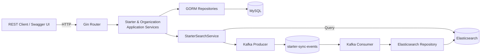
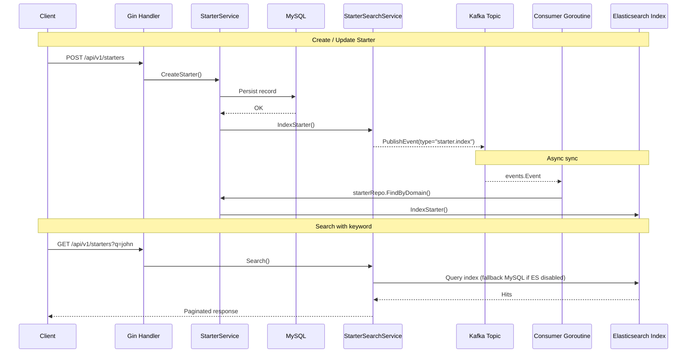

# Starter Management API

Backend Go service for managing starters, departments, and business units. Core data lives in MySQL, while Kafka and
Elasticsearch keep the search index in sync.

## Architecture Overview



## Event Flow



## Kafka & Elasticsearch Orchestration

- **Topic**: `starter-sync-events` (configurable via `KAFKA_TOPIC_SYNC_EVENTS`). Messages are JSON
  [`events.Event`](pkg/events/sync_event.go) envelopes.
- **Producer**: `StarterSearchService.IndexStarter` & `DeleteFromIndex` emit `starter.index` / `starter.delete` events
  (`services/starter-service/internal/starter/application/service/search_service.go`). Producer is wired in `InitStarter`
  when `KAFKA_BROKERS` is present (`services/starter-service/internal/initialize/organization/starter_handler.go`).
- **Consumer group**: `starter-sync-consumer` (env `KAFKA_CONSUMER_GROUP`). A background goroutine starts once at boot
  (`services/starter-service/internal/initialize/organization/starter_handler.go`) and continuously processes events via
  the shared Sarama wrapper (`pkg/kafka/consumer.go`), retrying with exponential backoff.
- **Elasticsearch index**: `starters` (
  `internal/organization/infrastructure/search/repository/starter_index_mapping.go`). `IndexManager` creates/reset index
  and checks emptiness; mappings use custom analyzers for prefix search. Documents mirror `StarterDocument` (
  `starter_document.go`) with extra fields (`full_text`, `search_tokens`, timestamps). Consumer handles `index` by
  reloading from MySQL and calling `ElasticsearchStarterRepository.IndexStarter`; `delete` triggers `DeleteFromIndex`.

## Quick Start (Docker Compose)

1. Install Docker & Docker Compose.
2. Ensure ports `3000`, `3306`, `9092`, `9200`, `5601` (optional) are free.
3. Start stack:
   ```bash
   make up
   ```
4. Check status & logs:
   ```bash
   make ps
   make logs-app
   ```
5. Access:
    - API base: `http://localhost:3000/api/v1`
    - Swagger: `http://localhost:3000/swagger/index.html`
    - Elasticsearch: `http://localhost:9200`
    - Kibana (optional): `http://localhost:5601`
6. Tear down:
   ```bash
   make down       # stop containers
   make clean      # stop + remove volumes
   ```

## Configuration

- Managed via Viper (`internal/config/config.go`) reading `.env_dev`.
- Key variables:
    - Database: `DB_HOST`, `DB_PORT`, `DB_USER`, `DB_PASSWORD`, `DB_NAME`.
    - Server: `SERVER_PORT`, `LOG_LEVEL`.
    - Elasticsearch: `ELASTICSEARCH_ADDRESSES`, `ELASTICSEARCH_USERNAME`, `ELASTICSEARCH_PASSWORD`.
    - Kafka: `KAFKA_BROKERS`, `KAFKA_TOPIC_SYNC_EVENTS`, `KAFKA_CONSUMER_GROUP`.
- Kafka/Elasticsearch are optional; system degrades gracefully with warnings when not configured.

## API Endpoints

| Method   | Endpoint                         | Description                                                                          |
|----------|----------------------------------|--------------------------------------------------------------------------------------|
| `GET`    | `/health`                        | Service health check                                                                 |
| `GET`    | `/api/v1/departments`            | List departments (supports `business_unit_id`, pagination)                           |
| `GET`    | `/api/v1/departments/:id`        | Department detail                                                                    |
| `POST`   | `/api/v1/departments`            | Create department                                                                    |
| `PATCH`  | `/api/v1/departments/:id`        | Update department                                                                    |
| `PATCH`  | `/api/v1/departments/:id/leader` | Assign/update department leader                                                      |
| `GET`    | `/api/v1/business-units`         | List business units                                                                  |
| `GET`    | `/api/v1/business-units/:id`     | Business unit detail                                                                 |
| `POST`   | `/api/v1/starters`               | Create starter                                                                       |
| `GET`    | `/api/v1/starters`               | List/search starters (`q`, `department_id`, `business_unit_id`, pagination, sorting) |
| `GET`    | `/api/v1/starters/:domain`       | Get starter by domain                                                                |
| `PATCH`  | `/api/v1/starters/:domain`       | Partial update starter                                                               |
| `DELETE` | `/api/v1/starters/:domain`       | Soft delete starter                                                                  |

## Makefile Commands

- `make logs-app`, `make logs-mysql`, `make logs-kafka`, `make logs-es` – inspect container logs.
- `make rebuild` – rebuild containers without cache.
